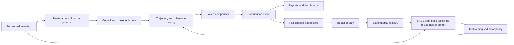
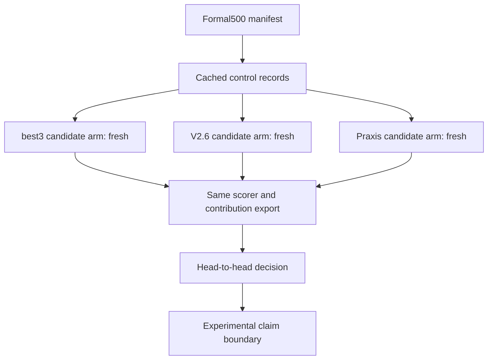

# Methodology Chapter 3 Prep: SAGE Gap-Closure Lab

Experimental preparation material. This document supports methodology writing; it is not protected final evidence.

## Study Object

SAGE is evaluated as a tool-evolution layer around ToolSandbox. The agent starts with the upstream base tools plus a bounded registry of generated helper tools. Helpers are side-effect-free unless explicitly classified as a safe action-spec normalizer; they should prepare arguments, choose records, compute deterministic values, or recommend abstention. Protected ToolSandbox side-effect tools remain responsible for mutating state.

## Pipeline Graphic



## Tool Lifecycle Graphic

```mermaid
stateDiagram-v2
  [*] --> PainPoint
  PainPoint --> CandidateDesign
  CandidateDesign --> StaticValidation
  StaticValidation --> SyntheticValidation: pass
  StaticValidation --> Parked: unsafe or invalid
  SyntheticValidation --> DevExecution: pass
  DevExecution --> RegistryCandidate: pass
  DevExecution --> Repair: fail
  Repair --> StaticValidation
  RegistryCandidate --> NaturalPilot
  NaturalPilot --> ForceDiagnostic: hidden or visible-not-called
  ForceDiagnostic --> AdoptionRepair: latent value
  AdoptionRepair --> NaturalPilot
  NaturalPilot --> ExpandedPilot: positive natural calls
  ExpandedPilot --> Confirmation
  Confirmation --> Scale
  Scale --> FrozenCandidate
  FrozenCandidate --> FinalHardeningReview
```

## Locked Matched Validation Graphic



## Pseudocode: Paired Validation

```text
input: manifest, registry, model_key, cache_policy
assert registry_hash_before == frozen_registry_hash
control_plan = plan_control_cache(manifest, model_key, cache_policy)
assert control_plan.selection_does_not_depend_on_candidate_registry

control_results = load_cached_controls_or_run_fresh(control_plan)
candidate_results = run_fresh_sage_arm(
    manifest=manifest,
    registry=registry,
    generation=off,
    openai_response_cache=off,
)

assert registry_hash_after == registry_hash_before
comparison = score_pairwise(control_results, candidate_results)
contribution = export_helper_contribution(comparison, candidate_results)
write_protocol_manifest(comparison, cache_report, registry_hashes, model_metadata)
write_dashboards(comparison, contribution)
```

## Pseudocode: Fair-Chance Diagnostic

```text
for each candidate_tool:
    if not routed:
        inspect route trigger and exposure reason
        repair route only on seed/dev or diagnostic split
    else if visible and not called:
        run safe force-exposure or force-call diagnostic
        if force-call helps and is side-effect-free:
            repair affordance, schema, or output shape
            rerun natural adoption
        else:
            classify as no latent value, unsafe, or unresolved
    else if called and task still fails:
        classify failed call as schema, input bridge, output readiness,
        negative trigger, route mismatch, or true negative value
        repair smallest plausible cause on dev-only examples

promotion_evidence = natural_calls and unseen_outcome_lift and zero_incidents
```

## Pseudocode: Per-Task Control Cache Rule

```text
eligible_control_cache_record if:
    same scenario/task name
    same agent model
    same user model
    same base tool policy
    at least 3 valid completed control records exist

excluded from matching:
    scenario checksum
    initial state checksum
    runner/scorer/toolsandbox version
    manifest checksum
    prompt hash
    model version hash

candidate arms never reuse SAGE traces as outcome evidence.
```

## Complete Setup

1. Checkout `exp/sage-gap-closure-lab`.
2. Activate the run environment with OpenAI credentials available, for example `conda run -n lifelong bash -lc 'export PYTHONPATH=src:.; ...'`.
3. Confirm registry integrity:

```bash
PYTHONPATH=src:. python scripts/migrate_registry.py --check-only \
  artifacts/registry_experiments/gap_closure_lab/best3_reference_copy/registry_manifest.json \
  artifacts/registry_experiments/gap_closure_lab/best3_v26_reference_copy/registry_manifest.json \
  artifacts/registry_experiments/gap_closure_lab/praxis_bridgepack_frozen_candidate/registry_manifest.json
```

4. Run matched formal validation with `--generation off`, `--disable-openai-response-cache`, `--cache-mode off`, `--parallel-arms`, and `--control-cache use-if-eligible`.
5. Inspect `paired_comparison.json`, `helper_contribution_summary.json`, `protocol_manifest.json`, `dashboard/task_focus.html`, and `dashboard/task_compare.html`.

## Research Requirements Mapping

| Requirement | Implementation |
| --- | --- |
| Same-task comparison | Control and SAGE arms share the identical manifest and scenario order. |
| No label leakage | Seed/dev labels only; unseen labels are not inspected before sealed runs. |
| No benchmark peeking in tools | Tools cannot encode scenario IDs, expected answers, hidden facts, or task-specific strings. |
| Cache transparency | Control cache records source, cached/fresh counts, matching rule, and manifest hash. |
| Fresh treatment arms | SAGE/candidate arms disable task cache and OpenAI response reuse for evidence runs. |
| Safety | Runtime exceptions, helper runtime incidents, and helper side-effect incidents are exported. |
| Contribution | Helper visibility, calls, VNC, called-subset outcome, and route mismatch are exported. |
| Progressive evaluation | Pilot, expanded, confirmation, and scale runs precede candidate freeze. |
| Reproducibility | Registry hashes, manifest hashes, model metadata, and run roots are recorded. |

## Methodological Limits

- The Praxis result is still experimental because branch-only actor/router bridge code is part of the treatment.
- The protected final evidence package is not modified from this branch.
- ToolSandbox milestone scoring remains the benchmark authority, but outcome/task completion is treated as primary when canonical/reference traces differ for defensible route substitutions.
- Per-task cached controls reduce cost but require careful model-key matching and explicit reporting.
- Force-call diagnostics are valid for root-cause analysis only; they are not promotion evidence.
- The current portfolio targets deterministic gaps in ToolSandbox-style tasks. It is not a general proof of open-domain agent reliability.

## Out Of Scope

- Final protected claim promotion.
- Human-subject evaluation.
- External web-service reliability claims.
- Production deployment of generated helper tools.
- Claims about models not run under the same manifest, model-key, cache, and registry conditions.
