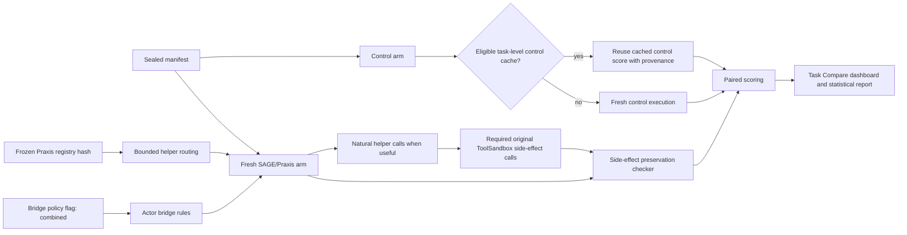

# Praxis Bridge Policy Methodology Note

Status: review-methodology supplement. This does not update protected final
claims by itself.

## Plain-English Treatment Definition

The high-lift Praxis behavior is not just "more tools in a registry." It is a
SAGE treatment that combines:

- a frozen deterministic helper registry; and
- a general actor/checker bridge policy that tells the model how to use those
  helpers without replacing required original ToolSandbox side-effect calls.

This is methodologically acceptable if it is named honestly. The correct claim
language is "Praxis combined treatment" or "Praxis registry plus bridge
policy." It should not be called a registry-only effect unless an ablation
reproduces the result with the bridge policy disabled.

## What The Bridge Policy Does

The bridge policy is enabled by `SAGE_PRAXIS_BRIDGE_POLICY=combined`.

It adds general task-solving policy, not benchmark answers:

- Prefer retained helpers when a task asks for deterministic recency,
  selection, timestamp conversion, precondition planning, contact lookup, or
  final-action preparation.
- Compose common helper sequences when the sequence is mechanically implied by
  visible state, such as current timestamp -> bounded reminder search ->
  visible-record selector -> timestamp conversion -> original `modify_reminder`.
- Use scrambled-name compatibility so the same policy applies when ToolSandbox
  exposes agent-facing tool aliases.
- Pass scalar or list arguments from visible tool outputs into helpers instead
  of opaque state dictionaries.
- Treat helper output as a prepared action or final-answer-ready value, while
  still calling the original ToolSandbox tool when the task requires a state
  change.
- Preserve the best final answer after helper calls and later environment
  calls.
- Treat `None` from original ToolSandbox state setters as success unless an
  explicit error is returned.
- Avoid invented temporal anchors: do not guess current years, timestamps, or
  timezones; use explicit user values, visible tool values, or environment
  defaults, and otherwise ask or abstain.
- Avoid unsafe substitutions in insufficient-information tasks: self contacts,
  unrelated search domains, broad guesses, and ambiguous records do not satisfy
  a missing target id for side-effecting actions.
- Audit helper-prepared side effects using both execution trace events and
  conversation-visible assistant tool calls.

The bridge policy does not:

- force any helper call;
- hard-code scenario IDs, labels, expected answers, task strings, or hidden
  benchmark facts;
- select or filter scenarios;
- enable SAGE/candidate task caching;
- reuse prior SAGE traces as outcome evidence;
- change the scorer.

## External-Service Cache Policy

RapidAPI-backed ToolSandbox tools are external service dependencies, not SAGE
task caches. During quota-limited repair/review gates, the declared treatment
may use the existing ToolSandbox RapidAPI request cache in read-only mode:

```text
TOOLSANDBOX_RAPID_CACHE_MODE=read_only
TOOLSANDBOX_RAPID_CACHE_PATH=.secrets/rapid_api_cache.json
```

The cache is keyed by request URL, RapidAPI host, and request parameters. A
cache hit returns the same external-service payload that a live call would have
returned; a cache miss fails visibly instead of spending quota. This does not
reuse prior SAGE traces or outcome evidence. Reports must record the cache
hash and hit/miss policy. The cache used for the 2026-05-11 recovery gates had
SHA-256 `3ed7732443c44d7d26e0f46ac32fa2e09fc773278368c6f13131021afafdbf25`;
see `docs/sage_protocol/praxis_external_service_cache_manifest.md`.

## Research Integrity Controls

Formal or review validation with this policy must use:

- a sealed manifest and fixed scenario order;
- generation off;
- a frozen registry hash recorded before the run;
- SAGE/candidate task cache off;
- OpenAI response cache disabled;
- control-cache use only for eligible control arms, with cached/fresh counts
  and manifest hash recorded;
- routing evidence disabled or explicitly pinned;
- no diagnostic force-call environment variables;
- zero runtime exceptions;
- zero helper side-effect preservation failures.

## Pipeline Pseudocode

```text
input:
    manifest M
    frozen_registry R with sha256 H
    bridge_policy flag B in {off, combined}

preflight:
    assert git/code state recorded
    assert sha256(R) == H
    assert generation == off
    assert candidate_task_cache == off
    assert openai_response_cache == disabled
    assert external_service_cache in {off, read_only_declared}
    assert routing_evidence in {disabled, pinned}
    assert no diagnostic force-call env vars

for task t in M:
    control_score[t] = run_or_reuse_control_cache(t)

    candidate_context = load_original_tools(t)
    candidate_context += route_bounded_helpers(R, t)

    if B == combined:
        candidate_context += bridge_actor_rules
        candidate_context += bridge_composers_for_visible_tool_outputs

    trajectory = run_candidate_fresh(t, candidate_context)

    safety[t] = check_helper_side_effect_preservation(
        trajectory.trace_events,
        trajectory.conversation_tool_calls,
        helper_metadata=R
    )

    score[t] = score_task(trajectory)

aggregate:
    report paired outcome delta
    report paired canonical/reference delta
    report exact successes
    report helper visible/called/VNC
    report called-subset contribution
    report safety and cache provenance
```

## Methodology Diagram



## Treatment Classification Rule

Use this classification table in Chapter 3 and review reports:

| Observation | Classification |
|---|---|
| Registry beats references with bridge disabled and zero safety failures | Registry-only Praxis |
| Registry does not reproduce without bridge, but reproduces with bridge and zero safety failures | Registry + bridge-policy Praxis |
| Best3/V2.6 also gain materially from bridge alone | Bridge-policy or general runtime repair effect |
| Lift depends on checker/scorer changes or force calls | Not claim-ready |
| Any helper side-effect failure remains nonzero | Promotion blocked |

## Current Validation Posture

The earlier registry-only repair is clean and promising, but it did not recover
the highest canonical lift. The combined policy is the proper way to recover
the high-lift Praxis behavior because it restores the missing SAGE operating
rules that make retained tools usable in natural runs.

This branch is validating the combined treatment with the frozen high-lift
registry and `SAGE_PRAXIS_BRIDGE_POLICY=combined`. Protected-claim promotion
still requires clean matched formal validation with zero side-effect incidents.

The latest same-code broad60 recovery gate used read-only RapidAPI external
service cache and produced canonical lift `+18.1%` and outcome lift `+51.2%`
with zero runtime or generated-tool failures. This is an encouraging scale-gate
signal, not protected final evidence; the next expensive validation should be a
clean 100 or 250 gate before any formal500 spend.
